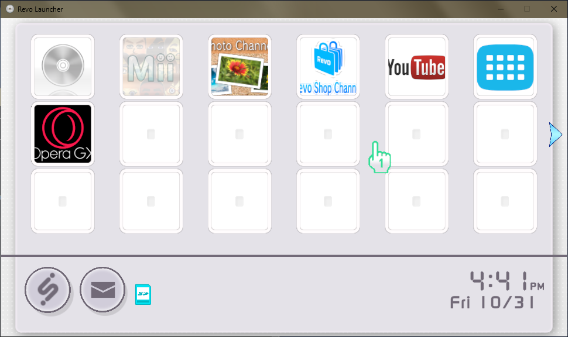
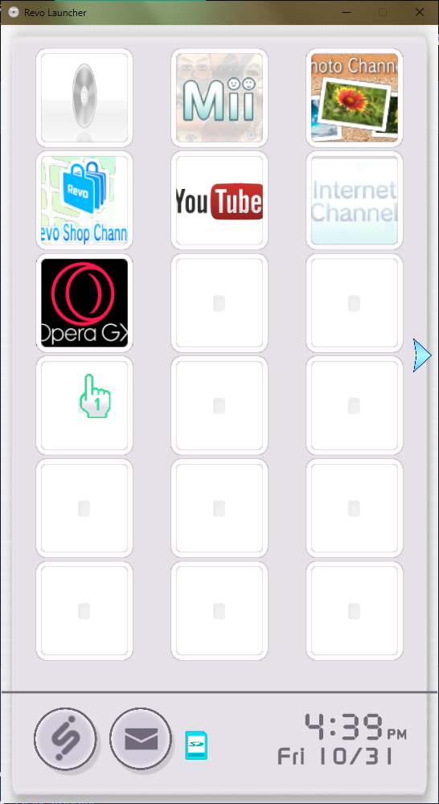
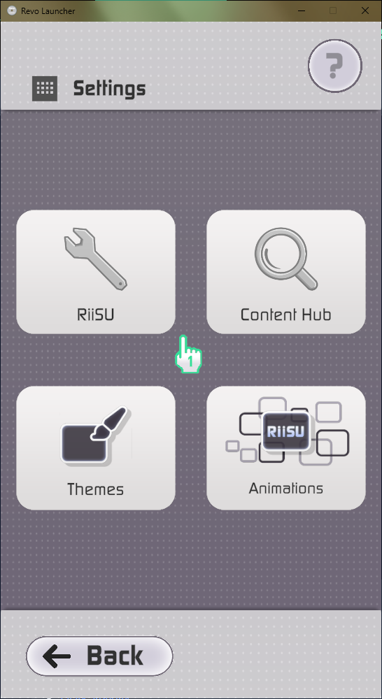
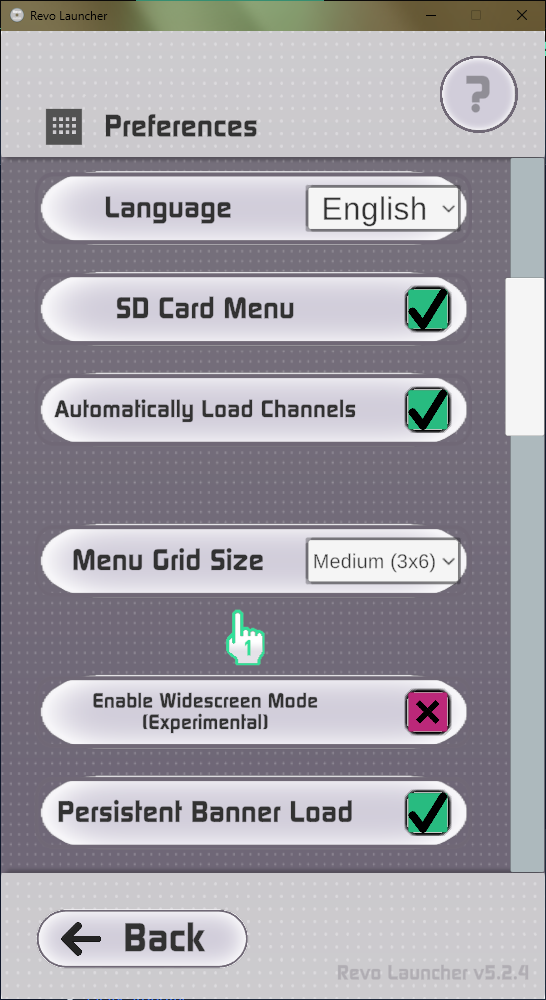
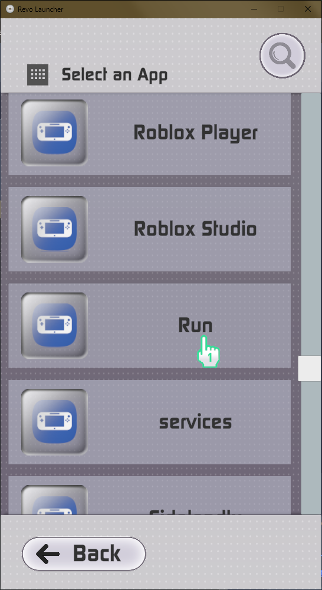

# RiiSU
An iiSU theme for Revo Launcher.

Was kind of inspired by the "[iiSU Interpreted](https://github.com/MrVictorFull57/iisu-interpreted-es-de)" theme for ES-DE.
Some graphics from there were modified for this project, and the sound effects were also borrowed from it.

The background music was taken from the [iiSU Complete Theme](https://www.youtube.com/watch?v=2tXiZQnPcfg) albeit edited so it can loop.

## Previews
- Widescreen

- Vertical

- Settings

- SD App Select

## Requirements
- Revo Launcher 5.1 or higher. (Started on 5.1, but works and was completed on the latest version.) - https://github.com/KaruzoHikari/Revo-Launcher/releases
- Good taste.

## Notes 
Extra graphics are in the /Images folder, while the theme itself can be found in the releases of [this repo](https://www.github.com/SIG7Pro/RiiSU-Theme-iiSU-for-Revo/releases/latest) or in the /Theme folder.

## Known Issues
- There's a line on the bottom of the home screen.
    - That line is hardcoded to be the main accent color. Making the color transparent would make the buttoms look odd, as they would be without an outline.
- Several Icons are Unchanged
    - Unless Revo Launcher makes it so you can change certain icons for certain tasks, then it's unlikely I will be able to change all the icons to make them fit in one way or another.
